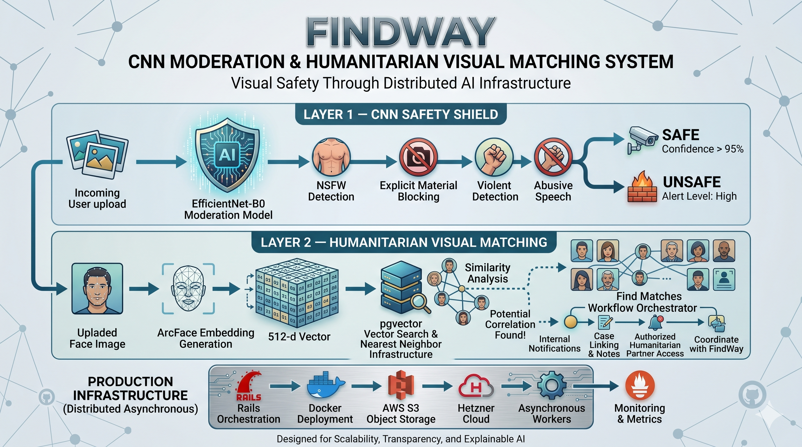

CNN Moderation & Humanitarian Visual Matching System
Visual Safety Through Distributed AI Infrastructure
https://nenashev.net/en/portfolio

FindWay uses a multi-layer computer vision architecture designed for scalable visual safety analysis, embedding-based similarity search, and humanitarian coordination workflows.

The platform combines lightweight CNN moderation models with vector-based visual matching pipelines to support:

platform safety,
real-time media analysis,
humanitarian search operations,
missing person coordination.

Unlike traditional moderation systems focused exclusively on content filtering, the architecture was designed around two simultaneous objectives:

maintaining a safe communication environment,
accelerating humanitarian identification workflows through explainable AI infrastructure.
Layer 1 — CNN Safety Shield

The visual safety layer is powered by optimized Convolutional Neural Network (CNN) models designed for:

low-latency inference,
distributed deployment,
asynchronous processing pipelines,
scalable moderation operations.

Core moderation model:

EfficientNet-B0

The model performs automated detection of:

NSFW imagery,
explicit visual material,
violent content,
abusive media patterns,
unsafe uploads.

The moderation layer operates in real time and integrates directly into FindWay’s distributed asynchronous infrastructure.

Primary engineering goals:

minimal inference latency,
production stability,
scalable deployment,
reduced moderation overhead.
Layer 2 — Humanitarian Visual Matching

To support humanitarian search workflows, FindWay integrates an embedding-based visual similarity subsystem built around:

ArcFace embedding generation,
vector similarity search,
pgvector infrastructure,
nearest-neighbor retrieval pipelines.

Instead of storing semantic identity information directly, the system transforms uploaded facial regions into high-dimensional mathematical vector representations optimized for similarity comparison.

Visual Processing Flow
Embedding Generation

Uploaded images are transformed into:

512-dimensional vector embeddings

using ArcFace-based feature extraction.

Vector Similarity Infrastructure

Generated embeddings are stored inside:

pgvector-powered vector search infrastructure

allowing scalable nearest-neighbor comparison across large image collections.

Similarity Analysis

When a newly generated embedding produces a sufficiently close mathematical similarity score relative to an existing search case:

the system identifies a potential visual correlation,
calculates similarity confidence,
triggers automated coordination workflows.
Automated Humanitarian Coordination

If a possible similarity event is detected between:

a newly uploaded report,
and an existing humanitarian search case,

the platform automatically generates internal notifications for authorized participants.

This supports:

accelerated coordination,
faster response workflows,
real-time humanitarian communication,
reduced search latency.
Production Infrastructure

The system operates on distributed asynchronous infrastructure built around:

Rails orchestration,
Docker deployment,
AWS S3 object storage,
Hetzner cloud infrastructure,
scalable processing queues,
asynchronous AI workers.

The architecture was intentionally designed for:

high-load environments,
concurrent inference operations,
large-scale media uploads,
real-time moderation requirements.
Explainable AI Infrastructure

FindWay avoids opaque “black-box” moderation logic.

Instead, the platform is built around:

explainable processing pipelines,
threshold-based risk calibration,
modular CNN systems,
observable infrastructure,
policy-controlled automation.

operational transparency,
safer deployment,
adaptive moderation behavior,
production-grade infrastructure stability.
